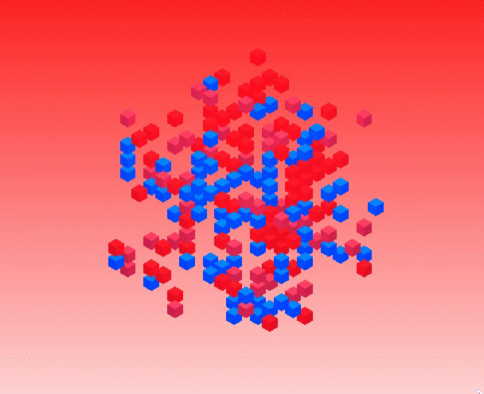
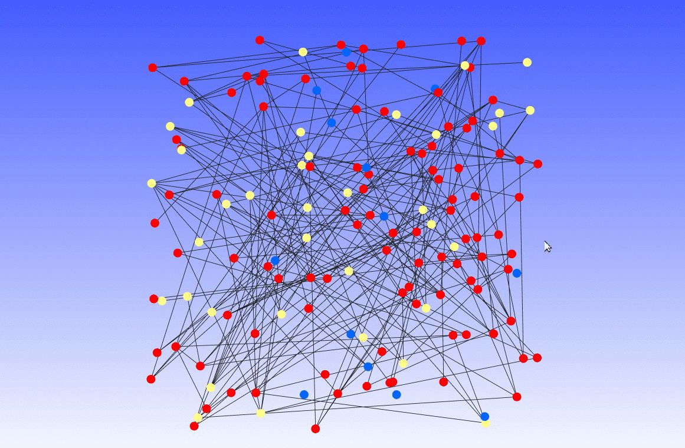

# System Designer

System Designer (`syd` for short) is a multi-agent simulation framework.

**System Designer is under heavy development so it is not recommended for use at this moment. APIs and everything else are subject to change.**

It is built on top of [aiomas](https://aiomas.readthedocs.io/en/latest/). At this time System Designer requires Python 3.5.

System Designer is designed to support large agent-based simulations where the agents themselves are computationally expensive. With simpler models like cellular automata you'll lose most of the framework's benefits (see below for a bit more details).

System Designer provides an easy way to emit arbitrary data, e.g. aggregate simulation reports every `n` steps, world grid states, etc, using `socketio`, so you can build arbitrary web visualizations on top:

## Design

See the [`docs`](docs) directory for notes on the framework's design and goals.

## Examples

Some examples are implemented in the `examples` folder.

To run an example:

    python -m examples <example name>

The available examples are: `schelling, sir, gameoflife`.

There's also `deepthought` which is just to demonstrate the trade-offs between single and multi-node simulations.

There are web visualizations for `schelling` and `gameoflife`; to view them run:

    syd front 8888 examples

The frontend for the two are located at `/schelling.html` and `/gameoflife.html` respectively. Once you have the frontend loaded you can run the example (e.g. `python examples schelling`) to start sending socketio messages to it.
